
<link rel="stylesheet" href="https://cdn.jsdelivr.net/npm/katex@0.16.9/dist/katex.min.css" integrity="sha384-n8MVd4RsNIU0tAv4ct0nTaAbDJwPJzDEaqSD1odI+WdtXRGWt2kTvGFasHpSy3SV" crossorigin="anonymous">

    <h1> Exploring Parameter Space </h1>

A <em>Nonlinear Dynamics and Chaos</em> Course Assignment

21421019 Yiges.M.x.

## 0. 前言

本笔记主要根据《Nonlinear Dynamics and Chaos With Applications to Physics, Biology, Chemistry, and Engineering》(Steven H. Strogatz) 一书中第五章以及检索到的相关内容，讨论 Lorenz 方程的参数空间，并提出一些有趣的想法。

笔者也尝试过使用 Mathematica 或其他数值/符号计算软件对 Lorenz 方程进行数值分析，但这些软件本身大部分局限于 CPU 绘制，在仿真的实时性、交互性上较差，若要使用 GPU 绘制，又需要通过 C/C++，使用 CUDA 或 OpenGL 接口从零开始编写，重新学习这些数值或符号计算软件与这些图形接口的配合十分复杂。于是笔者想到了结合正在学习的另一门计算机图形学的课程，通过使用 JS 编写仿真程序并通过使用 GLSL 的 WebGL 调用 GPU 来进行并行的实时绘制，实现实时的仿真和交互。本笔记的主要内容就是基于这个想法与检索到的开源仓库，经过大量的修改完善完成的。

当然其中一些静态图像的绘制依然使用了 Mathematica，但这些图像的绘制也是为了更好地展示一些概念，或者是为了更好地展示一些数值模拟的结果，所有相关部分的代码也将在附件中给出。
 
特别的，本文中的实时仿真过程对 Lorenz 系统的模拟使用了4阶 <a href="https://en.wikipedia.org/wiki/Runge%E2%80%93Kutta_methods">Runge-Kutta 方法</a> (RK4)。这个方法本身一定程度上保证了数值模拟的准确性，此外还可以通过进一步调整步长来进一步控制精度。由于是数值模拟，不同方法和选取的精度都可能会对结果产生影响，所以在这个具体实现中选取的初值，不一定在其他软件或平台上有相同的行为，甚至在调整精度（Step Size）后都会呈现不同的行为，这与数值计算的精度和系统本身的混沌性质都息息相关。
 
此外额外说明一下，未经说明的话（例如指明使用的初值），以下笔记中的模拟使用的初值都是每次运行时随机生成的，这有助于观察系统的一般性质与行为。（包括“生成一个点并对一个点加以扰动”，第一个点都是随机选取的，除非指定了被扰动点的位置，读者也可以在左侧面板中自行加入新的初值或清空所有解）

注：本篇文章是从仿真交互文档中摘出，将交互部分替换为录制好的内容以便阅读的，获得最佳体验请使用交互文档。
  
## 1. 混沌 与 Lorenz Equation

### 1.1 混沌的一种定义

- 确定性非周期性
- 对初值的敏感依赖性
- 长期行为的不可预测性
- 紧致性：一个紧致系统的每一条轨道都有极限集

### 1.2 Lorenz 方程的定义

    

        Lorentz 方程来源
    

    

        Lorenz 方程是基于纳维－斯托克斯方程 (Navier-Stokes equations)、连续性方程和热传导方程简化得出，最初的形式为：
        $$
        \begin{aligned}
        \frac { \partial \vec v }{\partial t} + \left( \vec v \nabla \right) \vec v &=
        -\frac {\nabla p}{\rho} + \nu \nabla ^2 \vec v + \vec g \\
        {\frac {\partial \rho }{\partial t}}+\nabla \cdot \left(\rho {\vec {v}}\right) &= 0 \\
        {\frac {\partial T}{\partial t}}+\nabla \cdot \left(T{\vec {v}}\right) &= \chi \nabla ^{2}T \\
        \end{aligned}
        $$
        其中，$\vec v$ 为流速，$\rho$ 为流体密度，$T$ 为流体温度。$T_0$ 为上限温度，$p$ 为压强，$\vec g$ 为重力加速度，$\nu$ 为运动粘度系数，$\chi$ 为热扩散系数，$\gamma$ 为热膨胀系数。简化后获得下方的 Lorenz 方程。
        <h5>from <a href="https://zh.wikipedia.org/wiki/%E6%B4%9B%E4%BC%A6%E8%8C%A8%E5%90%B8%E5%BC%95%E5%AD%90">wikipedia</a></h5>
    

Lorenz 方程由 Lorenz 在研究大气对流时提出，用于描述大气中的对流运动。

$$
\begin{aligned}
  {x}' &= \sigma \left(y-x\right) \\
  {y}' &= \rho x - y - xz \\
  {z}' &= xy - \beta z\\
\end{aligned}
$$

式中，参数 $\sigma \gt 0,\rho \gt 0,\beta \gt 0$，$\sigma$ 为 Prandtl 数，$\rho$ 为 Rayleigh 数，$\beta$ 为几何参数（在对流问题中与卷的纵横比有关）。

 
在参数空间中，Lorenz 方程的解的性质随参数的变化而变化。三个参数中，$\sigma$ 和 $\beta$ 主要由系统本身决定，一般而言为常数。$\rho$ 可以理解为外界环境对系统的影响（输入）与系统耗散（泄漏/摩擦等）。

为了简化问题，我们首先选择在前两个参数固定时，改变 $\rho$ 来研究系统的性质。特别的参考各个文献，可以固定 $\sigma = 10$，$\beta = \frac{8}{3}$，来讨论 $\rho$ 的影响。相对于其他参数，这已经是一个简单的情形了，尽管通过接下来的分析我们依然可以发现它已经十分的复杂。

而对于其他参数，我也将在下面的分析后，再展示一些特殊的现象。这些现象与性质都可以体现出 Lorenz 系统有序与混沌之美的统一。

## 2. $\sigma = 10, \beta = \frac{8}{3}$

### 2.0 Illustration

首先我们通过前人或通过数值或通过解析的方式得到的分岔图，来大致了解固定 $\sigma = 10, \beta = \frac{8}{3}$ 时， $\rho$ 的影响。

首先是书中讨论参数空间时给到的一张图片：

    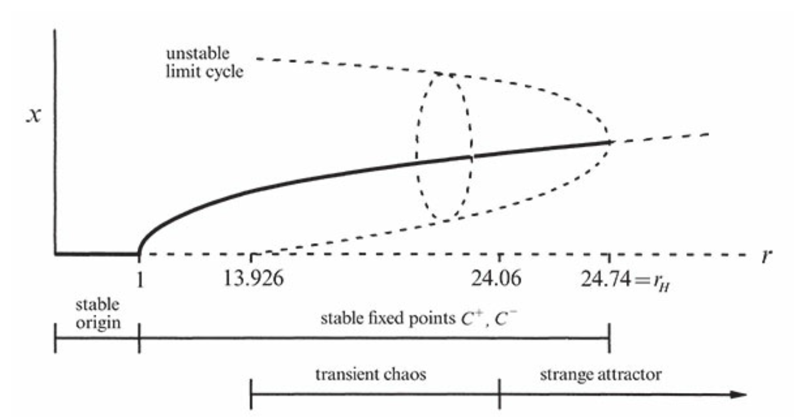

这张图片简单地给出了当 $0 \leq \rho \leq 28$ 时系统所发生的一些“简单的分岔”与系统所处于的整体状态，也是我们下面首先分析的参数范围。

然而对于更广的参数范围，我们可以通过数值的方法来得到更广的参数范围的“类分岔图”，或者类比于 Logistic Map，我们称其为轨线图，如下面这张图片：

    

我绘制出这张图片的第一反应是：一张非常瑰丽的图像，在混乱中带点规律，给人一种惊奇的感觉。它在很多范围内呈现混乱无序的状态，又在另一些区域内呈现令人惊讶的有序。而它何时有序，何时无序，似乎又是个“随机”的过程（尽管方程是“确定”的）。

这张图片使用 <a href="https://www.wolfram.com/">Wolfram Language</a> 绘制（代码见仓库），方式是对于每个 $\rho$ 采样多个点进行模拟，在足够长的时间内对解到达 $z$ 方向上的极值点进行记录，即 $z'=0$ 时将其 $z$ 值记录下来，最后将这些点绘制在对应 $\rho$ 上方。

所以这张图并不是严格意义上的“分岔图”，而是通过蒙特卡洛方法进行采样，在足够长时间后对系统的“渐进最终状态”的一个记录。
 
（如果先阅读后面的讨论，或结合起来看下面这些内容，可能会帮助理解）

若这些初值的解最终收敛到极限环上，那么图形会与对应 $\rho = r$ 形成可数个交点。注意这里一个极限环在这个图上“至少”会形成两个交点，因为我们只记录了 $z$ 方向上的极值点，而一个简单的环在 $z$ 方向上的极值点有两个，所以至少会形成两个交点（若环有倍周期特性或奇怪的形状，则会形成更多的交点，其中倍周期情形产生的多个极值点这也可以在下面倍周期的相关讨论里面看到直观的解释，奇怪形状产生的多极值点可以参考 $\rho \approx 100.0$ 那一个倍周期区间的模拟）。

若这些解收敛到不动点上，那么图形会与对应 $\rho = r$ 形成一个交点。

若这些解不收敛，或进行了周期很大的运动，则会形成一些散布在 $z$ 方向上的点，在图中呈现一些灰色的混乱区域。

由此可以看出这个类“分岔图”首先不能展示一些排斥子，或不能直观展示。其次，周期很大的解也不是非常清楚，例如倍周期分岔多次后的图形就很接近混沌了，当然当这条界限模糊时也说明系统已经进入到了某种程度上的混沌。最后，这个图也不能很好地区分各个极限环和不动点，重叠的极值点只会展示一个，因为其在维度上进行了很大程度的压缩（三维到一维）。但是这个图可以很好地展示出系统的整体行为，以及在不同的参数下系统的行为的变化。

下面我们也将细致讨论这张图中的绝大部分区域。

### 2.1 $\rho \lt 1 $

当 $\rho \lt 1 $ 时，经过课本中 9.2 的讨论，即通过对线性化系统的讨论和 Lyapunov 函数的构造，可以证明系统有全局稳定的不动点 $(0,0,0)$。

    

        例如，以下是对 $\rho = 0.5$ 的仿真结果：
    

    

        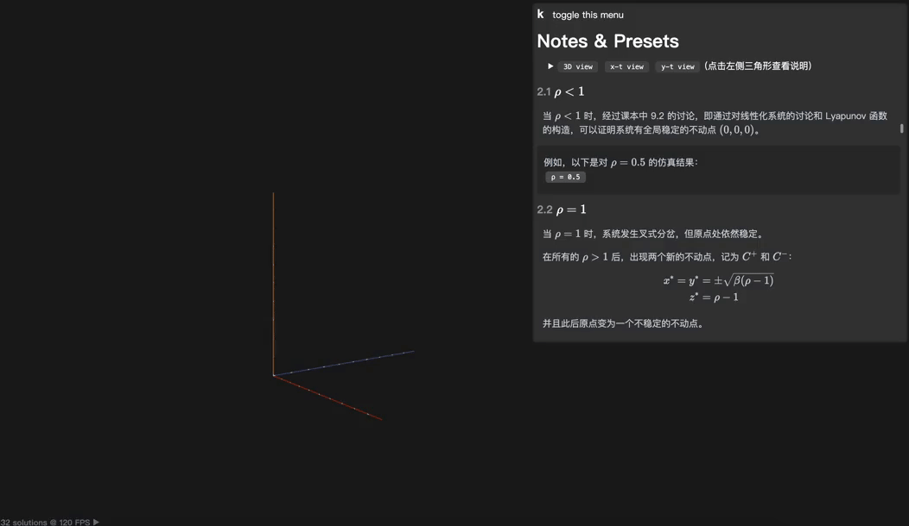
    

    
### 2.2 $\rho = 1$

当 $\rho = 1$ 时，系统发生叉式分岔，但原点处依然稳定。

在所有的 $\rho > 1$ 后，出现两个新的不动点，记为 $ C^+$ 和 $C^-$：
$$
\begin{aligned}
  x^* = y^* &= \pm \sqrt{\beta(\rho - 1)} \\
  z^* &= \rho - 1
\end{aligned}
$$
并且此后原点变为一个不稳定的不动点。

但注意，此时任意随机的初始解依然会向一个固定的范围内移动，再在这个区域内进行活动。这样说比较含糊，习题 9.2.2 对此作了研究，这里限于篇幅不再详细分析。简单来说，任意参数的 lorenz 系统的任意初值解最终都会被限制到一个椭球区域内（与三个系统参数相关），无论这些解最终收敛与否，甚至于出现后面分析的各种戏剧性状态，它们都一定会先运动到这个椭球区域内，在一个足够宏观的视角，看起来就像所有解都被吸引到了一个小椭球内。所以换句话说，被原点排斥的解也一定不会跑到无穷远的地方去，这可以结合后面提到的体积收缩和无不稳定极限环一起来理解看待。

### 2.3 $1 \lt \rho \lt 13.926$

当 $1 \lt \rho \lt 13.926$ 时，$C^+$ 和 $C^-$ 为稳定的不动点，原点为不稳定的不动点。并且 $C^+$ 和 $C^-$ 之间的距离随 $\rho$ 的增大而增大。

  

    例如，以下是对 $\rho = 10$ 的仿真结果，也可以自行调整 $\rho$ 的值观察此区间内解的变化：
  

  

        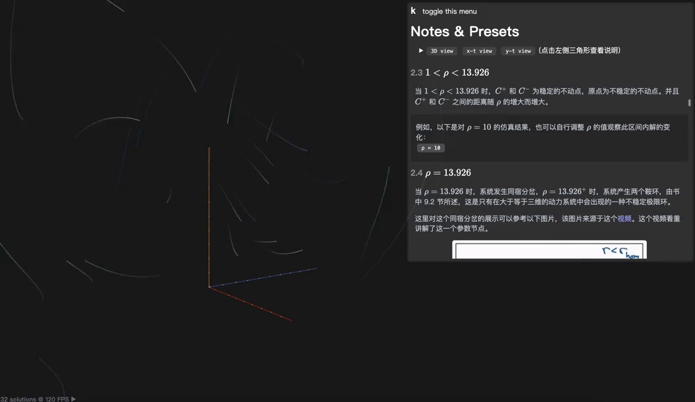
    

### 2.4 $\rho = 13.926$

当 $\rho = 13.926$ 时，原点的两个不稳定流形由稳定地被吸引到同侧不动点，戏剧性地突变为两个同宿轨道，即从原点出发又回到原点，并在此时发生同宿分岔。$\rho = 13.926^+$ 时，原点的两个不稳定流形收敛到异侧的稳定不动点，并且系统同宿分岔产生两个鞍环，由书中 9.2 节所述，这是只有在大于等于三维的动力系统中会出现的一种不稳定极限环，它在一个二维流形上是稳定的，在另一个二维流形上是不稳定的，但在空间中整体看来是不稳定的，从截面来看类似一个鞍点，两个流形构成一个类似十字骨架的结构。

这里对这个同宿分岔的展示可以参考以下图片，该图片来源于这个视频 <a href="#refs">[1]</a> 。这个视频着重讲解了这一个参数节点。

  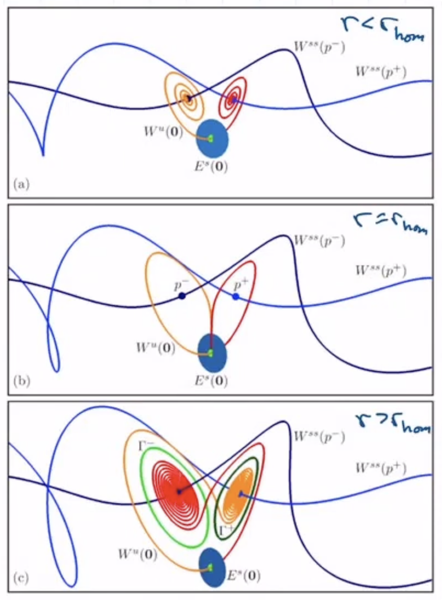

### 2.5 $13.926 \lt \rho \lt \rho_H = 24.74 $

当 $13.926 \lt \rho \lt r_H = 24.74 $ 时，两个鞍环快速向 $C^+$ 和 $C^-$ 靠近。

#### 2.5.1 $13.926 \lt \rho \lt r_H = 24.06 $

当 $13.926 \lt \rho \lt r_H = 24.06 $ 时，一个解除了直接、稳定地收敛到 $C^+$ 或 $C^-$ 外，还有可能会在两个鞍环之间来回震荡，并在可能相当长的时间后最终都会收敛到 $C^+$ 或 $C^-$。这也被称为<strong>“暂态混沌”</strong>，按书中所述，这种情况也被称为“亚稳态混沌”或“预湍流”。

根据书中所述，在 $ \rho = 13.926 $ 时，产生了非常复杂的不变集，这个集是一簇无限多个鞍环和非周期轨道组成的，他不是吸引子，也无法直接观察，所有其附近的解都对初值条件极其敏感。但解在这个集合附近杂乱无章地运动一段时间后依然会落到 $C^+$ 或 $C^-$。

这种情况下，一方面，按照 9.3 或前面给出的定义，动力系统并不是“混沌”的，因为其足够长期的行为并不是非周期的。另一方面，此时的动力系统依然表现出了对初始条件的极度敏感，即对一个初值条件加以轻微的扰动，他就可能从收敛到 $C^+$ 变为收敛到 $C^-$，或反之。

    

        例如，以下是对 $\rho = 21$ 的全局仿真结果（书中例9.5.1）：
    

    

        
    

    

        当然不是所有轨道都会出现暂态混沌，参考习题 9.5.6，我们找出 $\rho = 21$ 时，出现暂态混沌的三个初始条件，和不会出现暂态混沌的三个初始条件，分别作模拟：
    

    

        暂态混沌：
    

    

        
    

    

        选取了三个点：
         (1, 1, 20): 离 z 轴比较近，暂态混沌时间最久；
         (30, 30, 20): 离 z 轴比较远，暂态混沌时间较短；
         (30, 30, 10): 也离 z 轴比较远，暂态混沌时间很短。
    

    

        这里也单独将 $(1, 1, 20)$ 的情况以 $x-t$ 图的视角给出，观察一下所谓暂态混沌：
    

    

        
    

    

        非暂态混沌：
    

    

        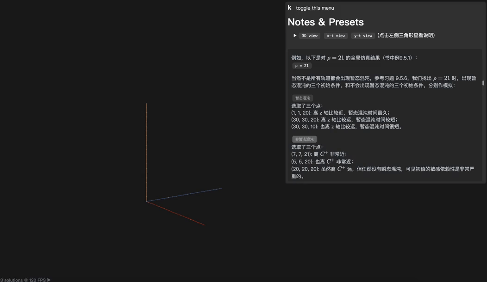
    

    

         选取了三个点：
         (7, 7, 21): 离 $C^+$ 非常近；
         (5, 5, 20): 也离 $C^+$ 非常近；
         (20, 20, 20): 虽然离 $C^+$ 远，但任然没有瞬态混沌，可见初值的敏感依赖性是非常严重的。
    

    

        如下给出预测初始条件能否导致暂态混沌的经验规则：
         - 如果离 $C^+$ 和 $C^-$ 的距离接近（比如在两个极限环内），那么大概率不会发生瞬态混沌。
         - 若距离 $C^+$ 和 $C^-$ 的距离远则有可能发生瞬态混沌，也可能不会发生
        （此时也对初值有比较强的敏感依赖性，这决定了一切都有可能，例如对
        (30, 30, 100)
        的初值加以扰动，就会有解分别收敛到 $C^+$ 和 $C^-$ 且暂态混沌时间长短差异很大，可以通过 x-t 或 y-t 对比）
        

            
        

         - 如果离 z 轴很近，则非常容易发生瞬态混沌（如(0.1, 0.1, 20)等）。
    

#### 2.5.2 $24.06 \lt \rho \lt r_H = 24.74 $

当 $\rho$ 非常接近 $13.926$ 时，鞍环较大，很难出现暂态混沌，系统比较容易收敛。而当 $\rho$ 较大时，书中讲到，[Yorke and Yorke, 1979] 最终证明了，在 $\rho$ 增大来到 $\gt 24.06$ 时，一个解在前面所提到的不变集附近游荡的时间就会变成 $\infty$，不变集变为一个<strong>“奇怪吸引子”</strong>。

书中 9.3 节对这个奇怪吸引子做了分析（虽然是对 $\rho = 28$ 分析讲解，但是是有普适性的）。这个吸引子不是不动的、稳定的，但其体积为 $0$，满足分析的体积收缩性质。此外，看起来它由两个曲面聚合而成，但由解的唯一性理论，这并不会发生。事实上，这是由无穷多离散的“曲面”组成的，有无穷大的面积而体积为 $0$ 的点集。这个奇怪吸引子也被称为<strong>“分形”</strong>，经分析它的纬度为 $D \approx 2.05$，这也在书的后续章节进行了讨论。

所以在 $24.06 \lt \rho \lt 24.74$ 时，系统有两种吸引子：一种是不动点 $C^+$ 和 $C^-$，另一个是奇怪吸引子。

此时一个解要么被吸引到 $C^+$ 和 $C^-$，要么被吸引到奇怪吸引子。

若解被吸引到奇怪吸引子，那么其轨道将会在奇怪吸引子附近无限长时间游荡，为紧致的，且轨道是非周期的，按照 9.3 或前面的定义，这是一种混沌的状态。

若解被吸引到 $C^+$ 或 $C^-$，虽然可能先会进入暂态混沌的形式，即在离不变集一段距离内游荡一段时间后收敛，但最终状态是稳定的，长期行为是确定的。

综上，虽然有的解是稳定的，即整个系统不满足混沌的定义，但系统会进入到近似混沌的状态。

    

        下面是对 $\rho = 24.3$ 的局部仿真结果: （在仿真交互文档中可以通过更改左侧“steps per frame”参数加速模拟，更直观看到效果）
    

    

        
    

    
在这个参数下，两个不动点坐标近似为：
        $$
        \begin{aligned}
        C^+ &= (\ 7.88247,\ 7.88247, 23.30)\\
        C^- &= (-7.88247, -7.88247, 23.30)
        \end{aligned}
        $$
        这个仿真选择了 $5$ 个初始条件：
        $$
        \begin{aligned}
        s_1 &= (5.5, 5.5, 23.30)\\
        s_2 &= (5.6, 5.6, 23.30)\\
        s_3 &= (5.7, 5.7, 23.30)\\
        s_4 &= (5.8, 5.8, 23.30)\\
        s_5 &= (5.9, 5.9, 23.30)
        \end{aligned}
        $$
        可以看到，$s_1$ 和 $s_2$ 缓慢离开极限环向外，被奇怪吸引子吸引，最终进入混沌的状态，在奇怪吸引子附近呈现复杂无规律的运动。并且注意这不是暂态混沌，是无限长时间在奇怪吸引子附近游荡，不会被 $C^+$ 或 $C^-$ 吸引。而 $s_3$ 很靠近极限环，但其还是缓慢离开极限环向内，最终和 $s_4$ 以及 $s_5$ 都被 $C^+$ 吸引并收敛。
    

    

        下面是对 $\rho = 24.3$ 的全局仿真结果: 
    

    

        
    

    

        可以注意到一些解逐步向内离开极限环，最终都被 $C^+$ 或 $C^-$ 吸引。而另一些点则在奇怪吸引子附近混沌地游荡，它们最终都不会被 $C^+$ 或 $C^-$ 吸引。
    

### 2.5.3 不动点和奇怪吸引子之间的滞后性

参考习题 9.5.4：假设我们稍微增加或减少 $\rho$ 的值，特别的令 $\rho = 24.4 + \sin\left( \omega t \right)$，其中 $\omega$ 是一个很小的常数，比吸引子的通常轨道的近似角频率要小。我们可以发现一个介于平衡点和混沌态之间的令人吃惊的滞后。

书中 9.5 节对此也做了如下描述：这意味着一个足够大的扰动能够使一个稳定运动的水车变成一个永久的混沌水车。

当然这个分析涉及到 $\rho \gt \rho_H$ 的情况，这在之后会进行讨论，这里简要说明当 $\rho$ 少量超过这个界限时，系统仅存在一个奇怪吸引子，系统为全局混沌的。

    

        例如，以下是对 $\rho = 24.4 + 1.5 \cdot\sin\left( \omega t \right)$ 的初值为 $(7, 7, 22.9)$ 的模拟结果：
    

    

        
    

 
从模拟结果来看，可以发现这个“滞后”是指：虽然某些时刻系统处于有稳定不动点的状态，但在后面某个时刻由于对于 $\rho$ 的扰动使得稳定不动点变为不稳定的，导致一些解在不动点周围游荡，在被吸引和排斥之间不断变化。一方面，如果对 $\rho$ 或这些解的扰动较大，这些解会被奇怪吸引子吸引从而使得解进入永久的混沌无序的状态。另一方面，某些初值的解也可能缓慢地最终被吸引到不动点，当然，也会有一些解看似永远不会被吸引或排斥。

### 2.6 $\rho = \rho_H = 24.74 $

当 $\rho = \rho_H$ 时，两个鞍环与 $C^+$ 和 $C^-$ 合并，系统发生亚临界 Hopf 分岔，此时 $C^+$ 和 $C^-$ 变为不稳定不动点。

### 2.7 $24.74 \lt \rho \lt 313 $

后 $C^+$ 和 $C^-$ 变为不稳定不动点，所有靠近的解都将被排斥到较远的吸引子。但我们知道，这个系统有体积收缩的性质，所以他不能被排斥到无穷远，而是会被排斥到一个有限的区域内。但从前面给出的书上的小范围分岔图上来看，我们看不到任何稳定轨道或不动点等吸引子的迹象。所以在这个范围一定有奇特的现象发生。现在我们知道，这一切都是一个或若干奇怪吸引子的作用（当然还有例外的情况，在一些参数下这个奇怪吸引子会发生戏剧性的变化，变为普通的极限环，后面会提到）。

#### 2.7.1 $24.74 \lt \rho \leq 28 $

课本 9.4 节，介绍了 Lorenz 及一些学者的工作。这些工作对略微大于 $24.74$ 的情况排除了稳定极限环，并且证明了 Lorenz 方程事实上存在奇怪吸引子，并不是数值模拟造成的“错觉”。

结论是，在 $\rho \gt \rho_H = 24.74 $ 后的一段 $\rho$ 范围内，系统只有一个奇怪吸引子，系统呈现全局的混沌状态：所有的解都会被奇怪吸引子吸引，在附近不规则、无周期地游荡。

    

        例如，以下是对 $\rho = 28$ 的全局随机仿真结果：
    

    

        
    

    

        这也是书中例 9.3 讨论的部分，这部分除了展示这种混沌特性外，还证明了相邻轨道的指数速度分离，并给出了混沌和奇怪吸引子的一种定义。其中的一些内容也在前面提及奇怪吸引子时有所涉及。
    

    

        我们也可以通过选择一系列初始非常接近的点（或者说对一个初值进行微小扰动），来直观感受“对初值的敏感依赖性”以及混沌的美：
    

    

        
    

#### 2.7.2 $28 \lt \rho \lt 313 $

这个范围的变得更为复杂，书中 9.5.2 提到，对于这个范围的绝大多数 $\rho$ 值，都发现了混沌现象，但也有周期行为的小窗口穿插进来。书中提到，最大的三个有周期行为的窗口是：

$$
\begin{aligned}
  99.524 &\lt \rho \lt 100.795 \\
  145 &\lt \rho \lt 166 \\
  214 &\lt \rho \lt 313
\end{aligned}
$$

当然，也能从开头给出的数值模拟得到的近似“分岔图”看到这些穿插的奇怪的有序区域。

下面将结合书中习题，选取一些区间或值进行一些模拟分析：

    

        首先，参考习题 9.5.1 和 9.5.3，对 $145 \lt \rho \lt 166$ 及附近的值进行仿真分析和大致分类。我们从 $\rho$ 由大到小的变化来详细看看这一过程：
    

    

        当 $ \rho > 166.07 $ （略微）时，没有极限环，系统进入一种“阵发性”混沌的状态，系统会在看似有稳定周期解一段时间后突然陷入短暂的混乱状态又恢复近似的周期解（看似在一个极限环的附近），并不断重复。
    

    

        以下是对 $ \rho = 166.3 $ 的仿真：（可以使用 x-t view 或 y-t view，并且以下所有模拟建议适当增加 simulation speed 来快速查看系统的更长期的行为）
    

    

        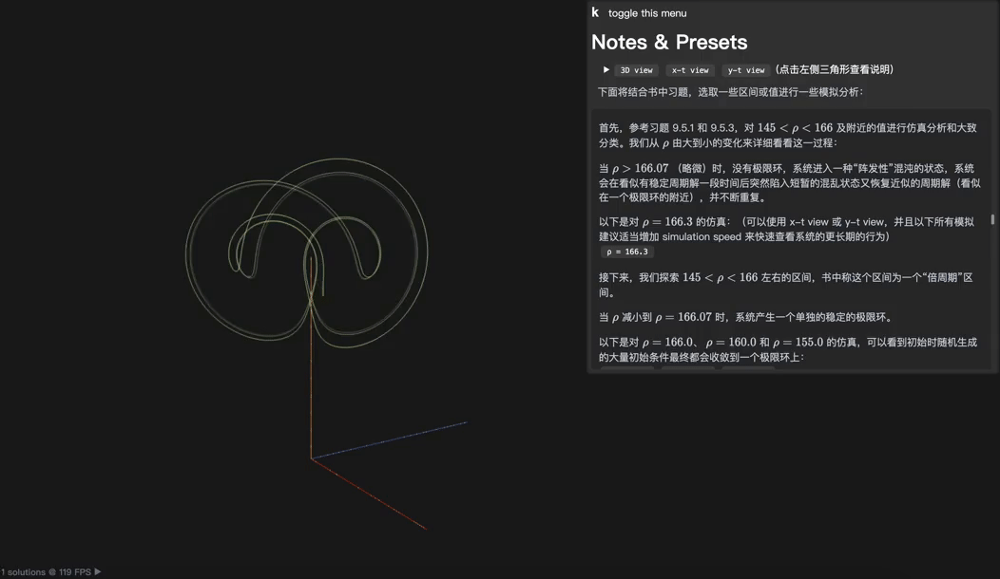
    

    

        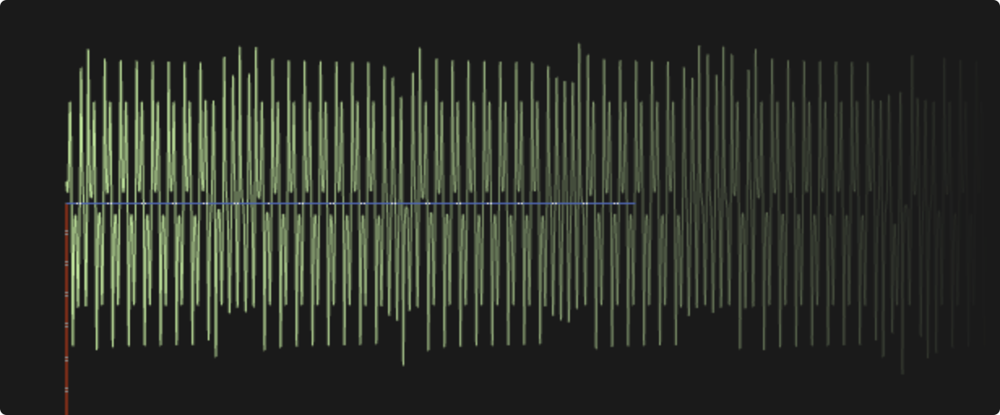
    

    

        接下来，我们探索 $145 \lt \rho \lt 166$ 左右的区间，书中称这个区间为一个“倍周期”区间。
    

    

        当 $\rho$ 减小到 $ \rho = 166.07 $ 时，系统产生一个单独的稳定的极限环。
    

    

        以下依序是对 $ \rho = 166.0 $、 $ \rho = 160.0 $ 和 $ \rho = 155.0 $ 的仿真，可以看到初始时随机生成的大量初始条件最终都会收敛到一个极限环上：
    

    

        
    

    

        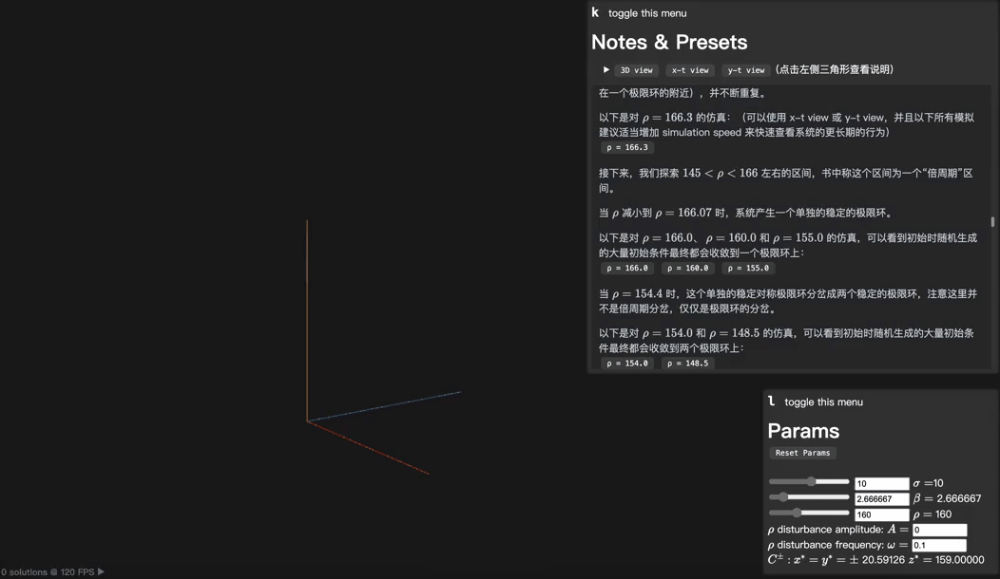
    

    

        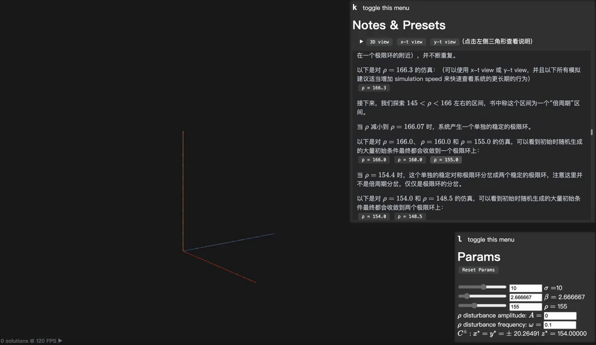
    

    

        当 $ \rho = 154.4 $ 时，这个单独的稳定对称极限环分岔成两个稳定的极限环，注意这里并不是倍周期分岔，仅仅是极限环的分岔。
    

    

        以下依序是对 $ \rho = 154.0 $ 和 $ \rho = 148.5 $ 的仿真，可以看到初始时随机生成的大量初始条件最终都会收敛到两个极限环上：
    

    

        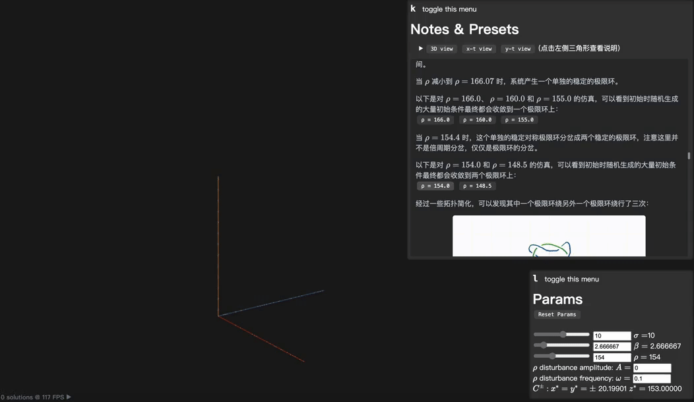
    

    

        
    

    

        经过一些拓扑简化，可以发现其中一个极限环绕另外一个极限环绕行了三次：
    

    

        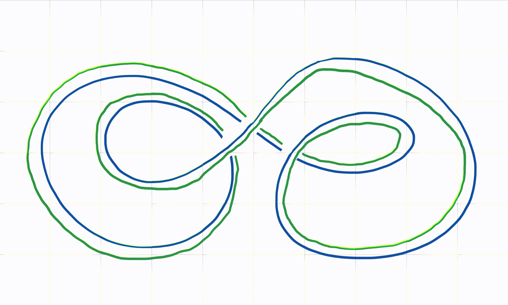
    

    

        当 $ \rho = 148.2 $ 时，这两个单独的极限环各自发生倍周期分岔，每个极限环周期翻倍。从图上看看起来是四个极限环，然而实际上每个极限环是在绕两周后回到原来的点。
    

    

        这里也可以通过如下图片直观理解所谓的“倍周期”分岔：
    

    

        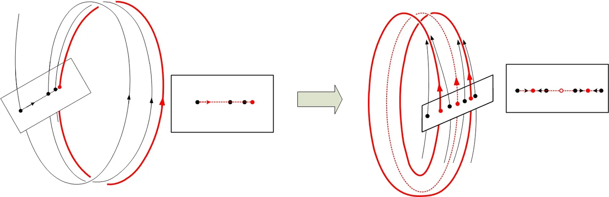
    

    

        即类似于这里左侧红色的稳定的极限环在一个参数临界点后忽然变为右侧这样周期翻倍的极限环的过程。也可以参照一维映射中的倍周期分岔的例子进行类比，他们都是一个周期轨道的周期加倍，并会当参数变化时，在一个降维映射中突然留下更多痕迹（例如Logistic Map）。
    

    

        当 $ 145 \lt \rho \lt 148.2 $ 时，随着 $\rho$ 的减小，出现了无限次这样的的周期翻倍的分岔，这也是 $145 \lt \rho \lt 166$ 被称为“倍周期”区间的原因。
    

    

        以下依序是对 $ \rho = 148.0 $ 和 $ \rho = 147.5 $ 的仿真，可以看到初始时随机生成的大量初始条件最终都会收敛到两个极限环上，且每个极限环实际绕了两圈，虽然看起来像多个独立的极限环。
    

    

        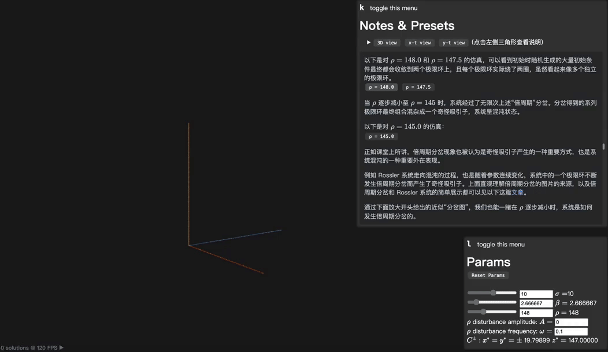
    

    

        
    

    

        当 $\rho$ 逐步减小至 $ \rho = 145 $ 时，系统经过了无限次上述“倍周期”分岔。分岔得到的两个周期无限长的极限环最终组合、混杂成一个奇怪吸引子，系统呈混沌状态。
    

    

        以下是对 $ \rho = 145.0 $ 的仿真：
    

    

        
    

    

        正如课堂上所讲，倍周期分岔现象也被认为是奇怪吸引子产生的一种重要方式，也是系统混沌的一种重要外在表现。
    

    

        例如 Rossler 系统走向混沌的过程，也是随着参数连续变化，系统中的一个极限环不断发生倍周期分岔而产生了奇怪吸引子。上面直观理解倍周期分岔的图片的来源，以及倍周期分岔和 Rossler 系统的简单展示都可以见以下这篇文章<a href="#refs">[5]</a>。我们后来提到的 Lorenz Map一维映射也是如此，这也将在稍微作一些分析。
    

    

        这里是对 Rossler 系统的简单可视化：
    

    

        
    

    

        通过下面放大开头给出的近似“分岔图”，我们也能一睹在 $\rho$ 逐步减小时，系统是如何发生倍周期分岔的。
    

    

        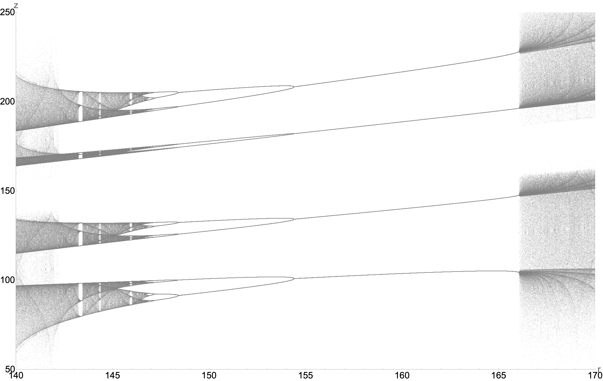
    

    

        可以看到随着 $\rho$ 逐步减小，混沌的状态戛然而止，并且结合模拟我们可以知道，这是由于系统产生一个有四个不同 $z$ 方向极值（下面简称极值）的关于 $z$ 轴中心对称的极限环。在 $\rho \approx 154.4 $ 时，突然变成了八个不同极值，结合模拟可以知道，这是由于上述极限环发生了分裂，生成了两个极限环，每个极限环都有 $8$ 个不同的极值，但由于两个极限环关于 $z$ 轴中心对称，所以他们一共只有八个不同的极值（也就是说在这个图上重叠了，并且由于这个对称性导致的重叠，后续我们始终只能在图上看见一个极限环的极值）。在 $\rho \approx 148.2 $ 时，极值数量再次翻倍，结合模拟可以发现，这是由于上述两个极限环发生了倍周期分岔，每个极限环周期翻倍，并且极值数量也发生了翻倍，且虽然每个极限环两次绕行的轨道间距很小，但依然造成了不同的极值。此后发生这样的分岔的 $\rho$ 的间距越来越小，并且这些极值迅速产生重叠，并进入混沌的状态。
    

    

        此外也可以发现在 $\rho \lt 145.0$ （略微）的时候，也存在一些很小的周期窗口，例如 $\rho \approx 143.3$，这里发生的事情与此前讨论的 $145 \lt \rho \lt 166$ 如出一辙，可以自行模拟尝试。
    

    

        注：虽然不能通过分岔图直接得出各种分岔的结论，因为前面也提到图上的这种看起来的“分岔”可能是多种原因造成的，并且就算有分岔也不一定会显示在图上，这也是降维过程中一定存在的损失。不过我们依然能从图上窥见上面这些有趣的现象。
    

    

        与 $145 \lt \rho \lt 166$ 类似，我们对 $212 \lt \rho \lt 313$ 及附近的值进行仿真分析和大致分类。但这次我们从 $\rho$ 由小到大的变化来简略地看看这一过程：
    

    

        首先，参考习题 9.5.2 简单看看 ，当 $\rho = 212$ 时，系统所呈现的性质。
    

    

        以下是对 $ \rho = 212.0 $ 的仿真：
    

    

        
    

    

        可以看到所有解最终都在两个互相穿过的拓扑区域（两个奇怪吸引子？）内进行类似周期的混乱行为，这在书中称为噪声周期性。相比于前面分析的 $145 \lt \rho \lt 166$ 区间中的两个极限环，这里的两个区域更加明显，且容易发现其中一个区域只绕行了另一个区域一次。
    

    

        当 $ \rho = 213.0 $ 左右时，上述两个区域迅速塌缩，系统产生两个稳定对称的极限环（看起来是两组，每组都有非常多极限环，但实际上是两个，只是每个极限环的周期非常大，会在相近的一系列轨道上绕行很多圈回到原来的地方，就和此前 $145 \lt \rho \lt 166$ 讨论的类似）。
    

    

        当 $ \rho = 231.0 $ 左右时，上述两个极限环最终各自自己与自己合并为一个周期最小的极限环，整个系统此时存在两个互相穿过的简单环。
    

    

        以上过程可以通过自行缓慢增加 $\rho$ 的方式来观察（滑动下方的 $\rho$ 旁边的滑动条，或点击/按住输入框旁边的三角形），以下是对中间过程 $ \rho = 224.0 $ 和 $ \rho = 231.0 $ 的仿真：
    

    

        
    

    

        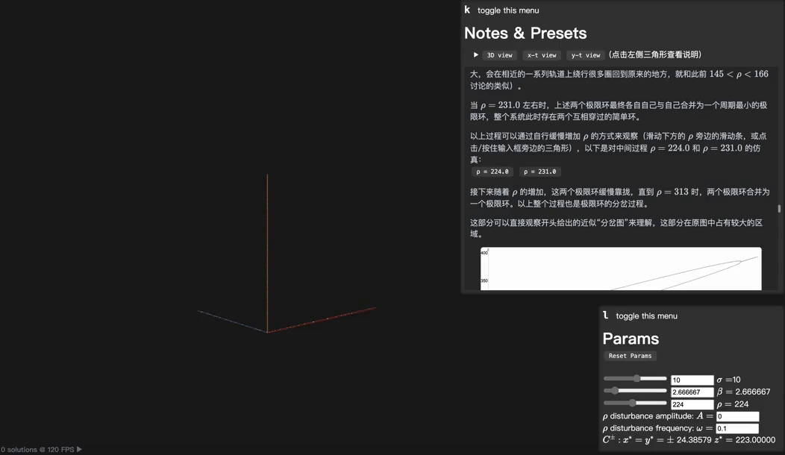
    

    

        接下来随着 $\rho$ 的增加，这两个极限环缓慢靠拢，直到 $\rho = 313$ 时，两个极限环合并为一个极限环。以上整个过程也是极限环的分岔过程。
    

    

        这部分可以直接观察开头给出的近似“分岔图”来理解，这部分在原图中占有较大的区域。
    

    

        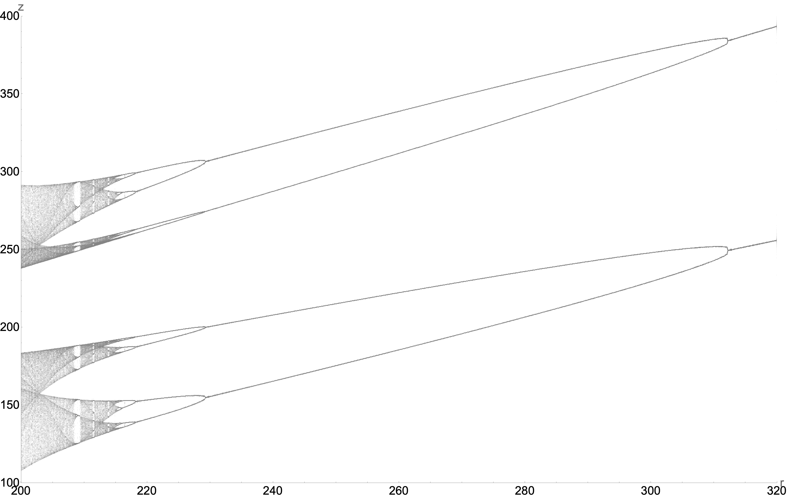
    

    

        同样的，通过放大 $99.524 \lt \rho \lt 100.795$ 等这些区域，我们也能得到相似的结论。
    

    

        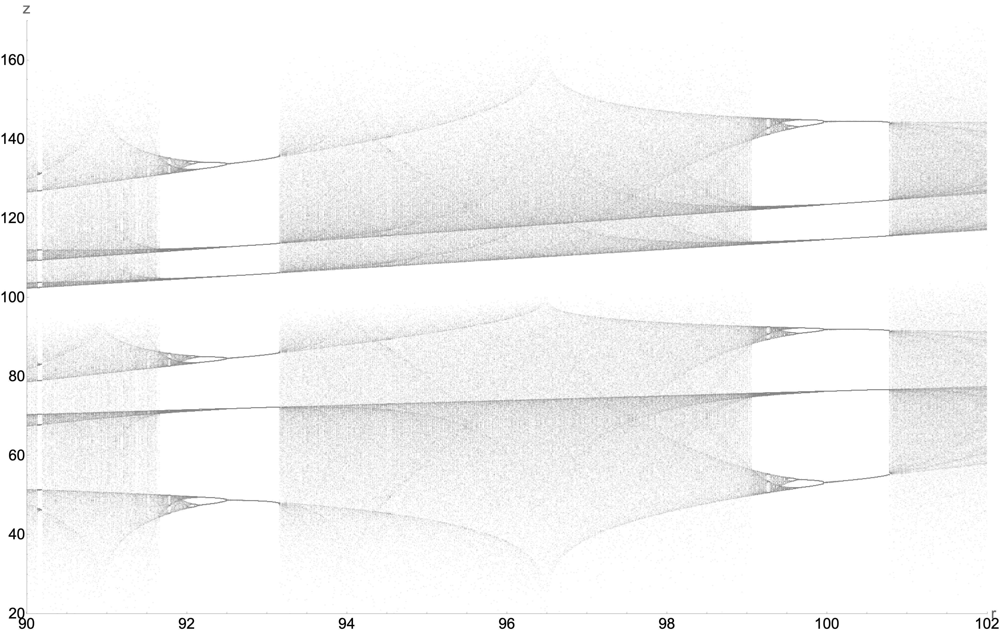
    

    

        这里也不展开讲解了，这也同样展现了“倍周期分岔是通往混沌的一种重要方式”。值得一提的是这里出现了三的倍数的极值点，通过自行模拟，可以发现这其实是形状更加奇怪的极限环:)。
    

#### 2.7.3 一个猜想

现在回过头来看这些“分岔图”，我们留意到和我们讲一维映射时提到的 Logistic Map 所呈现的分岔图有些类似，所以可以尝试从中得到一些什么类似的信息，下面我们将在直觉和数值上验证这种想法，不过首先，先回顾一下相关内容：

首先，我们在 Logistic Map 中，由一维映射 
$$
x_{n+1} = f(x_n) = r \cdot x_n \cdot \left( 1 - x_n \right)
$$
得到了如下系统长期演化的渐进稳态的轨线图，与我们绘制的 Lorenz 系统的“分岔图”（轨线图）非常类似：

    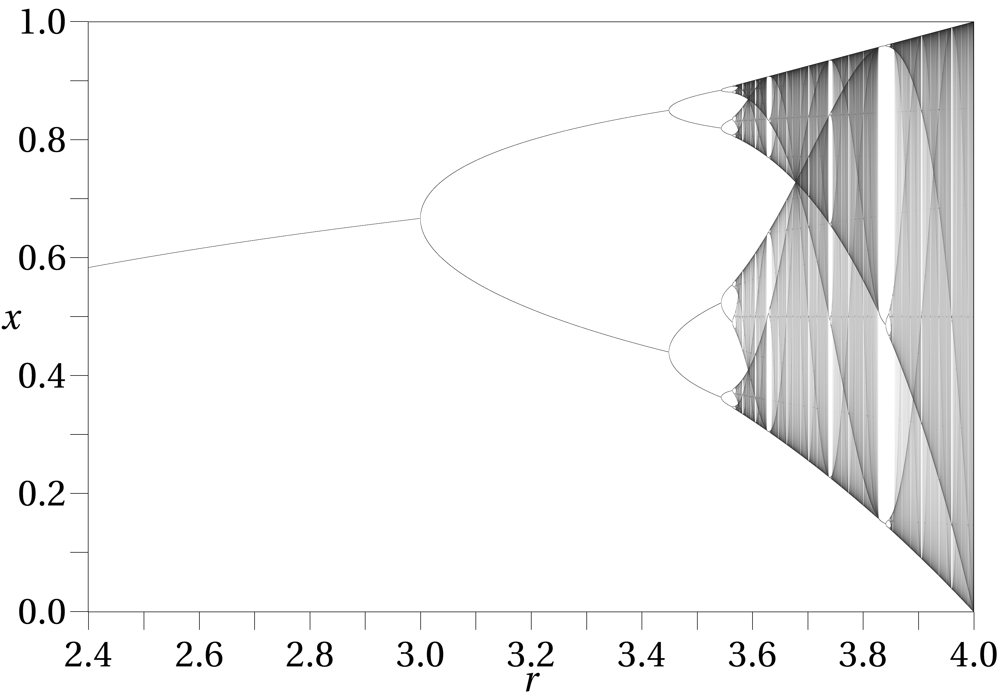

我们知道了他是如何描述在 $r$ 逐渐增大时，Logistic Map 是如何不断产生倍周期分岔并最终走向混沌的，如下图所示：

    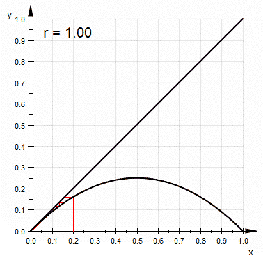

其次，根据我们对 Logistic Map 的学习，我们知道，一个展开式中含有二次及以上项的一维映射，无论形状如何进行一个变换，都会在局部产生和最简单的 Logistic Map 类似的混沌现象（例如高次多项式、三角函数极值点附近等）。所以我们猜测 Lorenz 系统在某些视角下也可以得到类似的结论。

再者，我们还对 Lorenz 研究 $\rho = 28$ 时的系统时所用的 Lorenz Map 有一些了解。在 9.4 节我们了解到 Lorenz 使用这种映射导数绝对值大于 1 （对应一维映射特征乘子绝对值大于一）证明了系统在对应参数下是没有稳定极限环的（对应一维映射没有不动点）。这个映射定义为：
$$
z_{n+1} = f \left( z_{n} \right)
$$
其中 $z_{n}$ 为解的局部最大值点序列。我们通过大量的数值模拟可以绘制出这个映射的图像：

    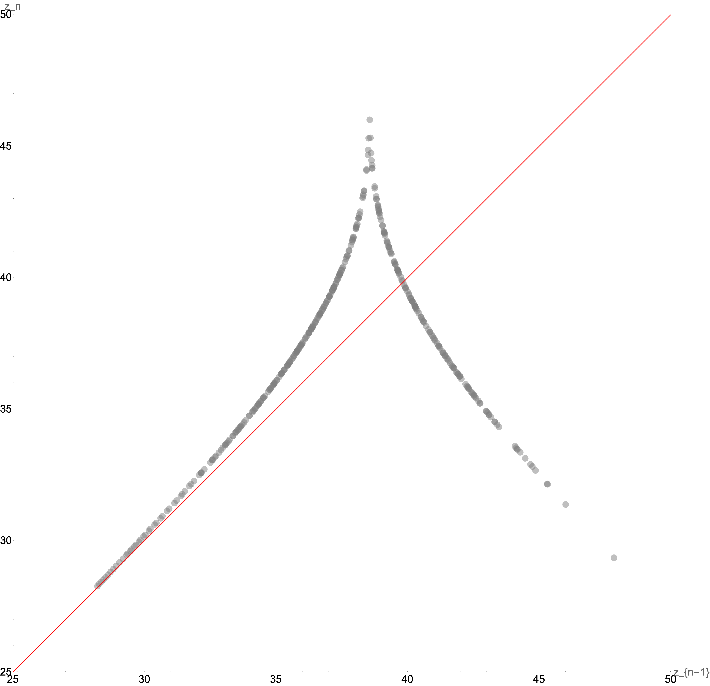

最后，我们也知道 Lorenz 在每个平面上的投影都显示出了混沌特性，即降维到二维依然可以看出其混沌特性。

    

        结合以上几点，我们提出猜想：“在那些倍周期分岔的参数范围中，Lorenz 系统在某些视角下（某些降维映射，尤其是先投影到平面，再降维至一维时），依然有混沌特性，且这个映射与 Logistic Map 一样有局部的二次项特性，从而导致其和 Logistic Map 一样产生倍周期分岔并最终走向混沌。”
    

    

        基于这个猜想，我构造了如下映射：
        $$
        y_{n+1} = f \left( y_{n} \right)
        $$
        其中 $y_{n}$ 为解的所有同向穿过 $y-z$ 平面的点（即 $x=0$ 且同向）的序列。
    

    

        注意到我们这里其实首先构造了一个 $ \text{Poincaré} $ 映射，即首次-回归映射，然后再降维到一维。详细来说，我们首先记录了一个解首次同向穿过 $y-z$ 平面的位置，然后只保留其 $y$ 坐标，即得到了一个类似于 Lorenz 映射的一维映射。
    

    

        然后，我们在发生了倍周期分岔的 $212 \lt \rho \lt 313$ 区间（其他区间理论也可以）进行验证。并且由于Logistic Map 在 $r$ 从小到大时发生了倍周期分岔，而 Lorenz 系统在 $212 \lt \rho \lt 313$ 区间在 $\rho$ 由大变小时也发生了倍周期分岔，我们在这个区间从大到小采样几个点作对比分析：
    

    

        $ \rho = 340 $ 时，我们得到如下一维映射图像：（以下代码均见附件）
    

    

        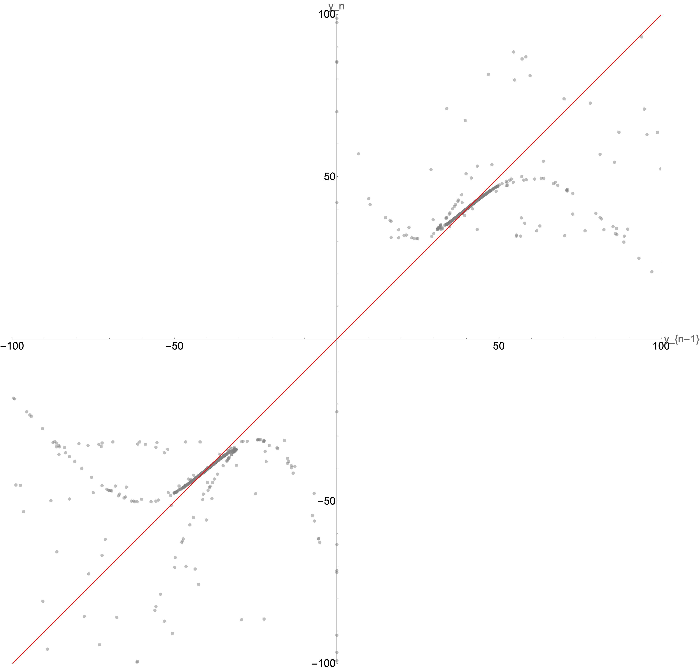
    

    

        与 Lorenz Map 类似，我们将随机采样模拟的映射图进行一些近似。由于对称性，我们仅需要关注第一象限。可以隐约看到两条像三次曲线的曲线，且与 $x_{n+1} = x_n$ 交点处斜率绝对值小于1，即线性化后这个一维映射在交点处为一个稳定的不动点，这与降维前的 Lorenz 系统的此时有全局吸引的唯一极限环是一致的。类比 Logistic Map，这里的图像看起来仅仅对应 $r$ 小于 $1$ 的情况。
    

    

        $ \rho = 300 $ 时，我们得到如下一维映射图像：
    

    

        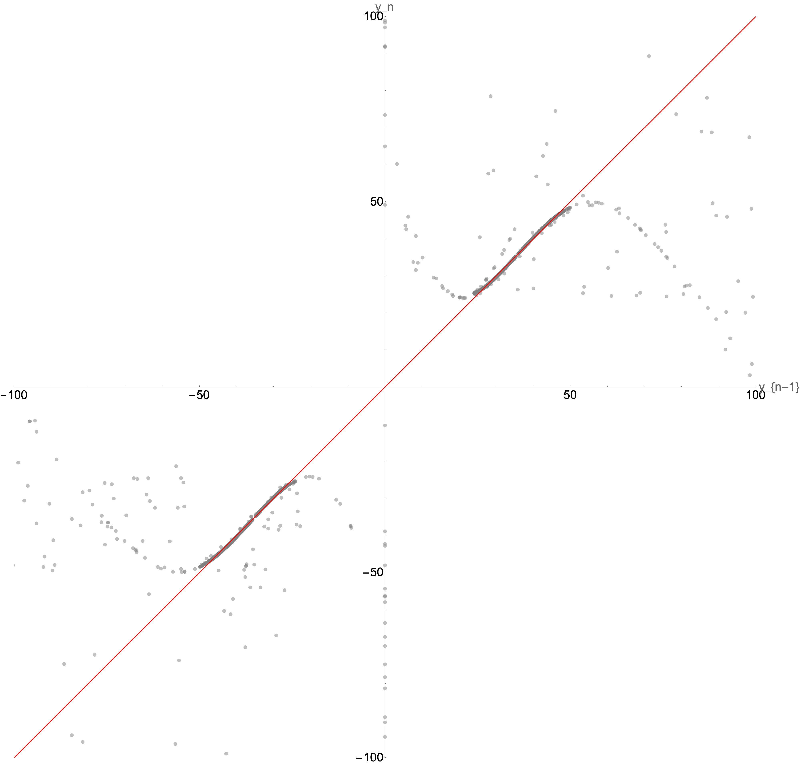
    

    

        根据之前的分析，此时系统在 $\rho$ 减小过程中刚发生一次分岔，产生了两个稳定极限环。而图中映射与 $x_{n+1} = x_n$ 交点增加至了三个，斜率依次 小于1、大于1、小于1，即线性化后这个一维映射在交点处分别为一个稳定的不动点、一个不稳定的不动点、一个稳定的不动点，这与降维前的 Lorenz 系统的此时有两个稳定的极限环（中间的点被牵引至两个极限环中的一个）也是一致的。
    

    

        且与 Logistic Map 类似，这里的图像的样子看起来仅仅对应 $r$ 刚刚大于 $1$ 的情况，情况并没有变的复杂。但我们能想象到，随着 $\rho$ 的进一步减小，这个映射的图像会向中央继续压缩，直到与 $x_{n+1} = x_n$ 的一些交点来到映射曲线极值点的另一侧，产生与上面 Logistic Map 产生倍周期分岔时类似的图像。数值模拟也证实了这一点。
    

    

        以下是对 $ \rho = 230 $ 的一维映射图像：
    

    

        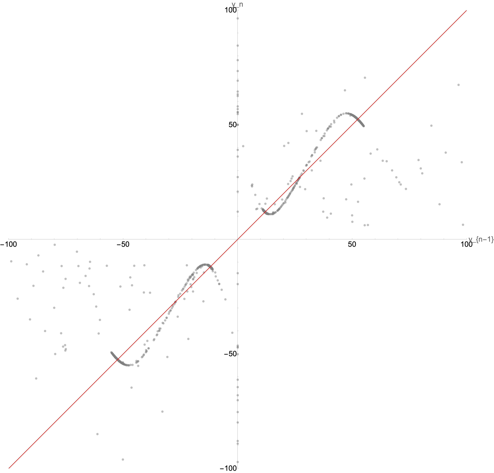
    

    

        与我们预期的一样，这里的图像已经开始出现了类似 Logistic Map 产生倍周期分岔时的类似图像。且随着 $\rho$ 的进一步减小（$r$ 逐步增大到 $r_{\infty}$），情况会更加严重：
    

    

        以下是对 $ \rho = 220 $ 的一维映射图像：
    

    

        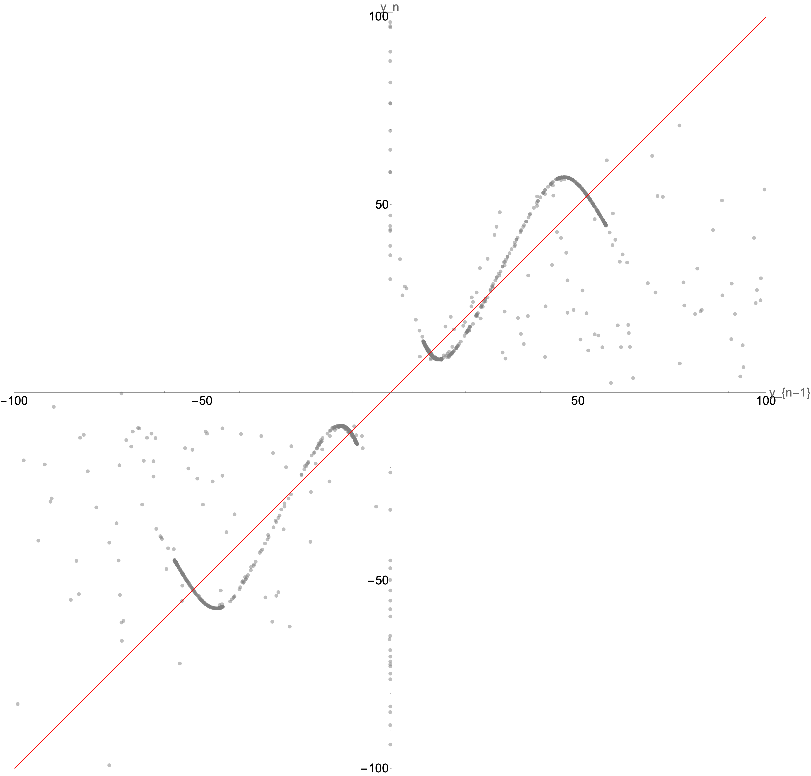
    

    

        在这些图上，我们用类似一维映射时用到的蛛网模型进行模拟，也能得到类似于 Logistic Map 产生的混沌结果（没有周期的无规则行为）。由于时间限制，这里没有进一步的数值和解析验证，这里提供一个思路：对图中的点作回归，并进行一维映射的模拟，来进行 Logistic Map 的相似性对比。
    

    

        通过以上探究，我们确实发现 Lorenz 系统在一些范围内的倍周期特性和 Logistic Map 的倍周期特性有着惊人的相似性，这样或许意味着关于“周期三意味着混沌”等种种结论可以在 Lorenz 系统中得到类似的应用与验证。
    

### 2.8 $\rho \gt 313 $

当 $\rho$ 充分大，特别的，当 $\rho \gt 313 $ 时，动力学系统再次变的简单。

    

        以下是参考例题 9.5.2 对 $ \rho = 350.0 $ 的仿真：
    

    

        
    

数值实验表明，此时系统有一个全局吸引的极限环。书中提到，Robbins 使用微扰法描述 $\rho$ 较大时的极限环，他的工作的一部分在习题 9.5.5 中给出：

    

        习题 9.5.5: 考虑 $\rho \rightarrow \infty$ 时的 Lorenz 系统，利用某种方式取极限，可以使方程中的所有耗散项消失 [Robbins, 1979, Sparrow, 1981]。
    

    

        

        (a) 令 $ \epsilon = \rho^{-\frac{1}{2}} $，因此 $\rho \rightarrow \infty$ 时 $ \epsilon \rightarrow 0 $。
        求一个包含 $\epsilon$ 的变量变换，使得当 $\epsilon \rightarrow 0$ 时，洛伦兹方程变为：
        $$
        \begin{aligned}
            {X}' &= Y \\
            {Y}' &= -XZ \\
            {Z}' &= XY
        \end{aligned}
        $$
        

        

        解：由于洛伦兹方程中只有二阶项，我们考虑如下二阶的变量变换：
        $$
        \begin{aligned}
            X&=a_0 x + a_1\epsilon x + a_2 \left(\epsilon \right)^2 x \\ 
            Y&=b_0 y + b_1\epsilon y + b_2 \left(\epsilon \right)^2 y \\ 
            Z&=c_0 z + c_1\epsilon z + c_2 \left(\epsilon \right)^2 z
        \end{aligned}
        $$
        依照题意，将变量变换后代入洛仑兹方程中后我们需满足当 $\epsilon \rightarrow 0$ 时，方程有如下形式：
        $$
        \begin{aligned}
            {X}' &= Y \\
            {Y}' &= -XZ \\
            {Z}' &= XY \\
        \end{aligned}
        $$
        于是（经过一些稍显复杂的待定系数求解过程）我们解得
        $$
        \begin{aligned}
            X &= \epsilon x \\
            Y &= \epsilon^2 \sigma y \\
            Z &= \sigma \left( \epsilon^2 z-1\right) \\
            \tau &= \frac{t}{\epsilon} 
        \end{aligned}
        $$
        

    

    

        

        (b) 求新系统的两个守恒量（即运动守恒量）
        

        

        解：
        $$ 
        \begin{aligned}
            { \left( Y^2+Z^2 \right) }'
            &= 2Y{Y}'+2Z{Z}'\\
            &= 2Y\left(-XZ\right)+2Z\left(XY\right)\\
            &= -2XYZ+2XYZ=0 \\ 
            { \left( X^2-2Z \right) }'
            &= 2X{X}'+2{Z}'\\
            &= 2XY-2XYY\\
            &= 0
        \end{aligned}
        $$
        

    

    

        

        (c) 证明新系统是体积不变的。（即根据系统的时间演化，任意一团“相流”的体积是不变的，尽管其形状会发生戏剧性的变化）
        

        

        解：新系统写为向量场形式：
        $$
        \vec{F} \left(X,Y,Z\right) = \begin{bmatrix} Y \\ -XZ \\ XY \end{bmatrix} \\
        $$
        我们知道向量场 $\vec{F}$ 的散度:
        $$
        \begin{aligned}
            \nabla \cdot \vec{F} &= \frac{\partial F_X}{\partial X} + \frac{\partial F_Y}{\partial Y} + \frac{\partial F_Z}{\partial Z} \\
            &= 0
        \end{aligned}
        $$
        所以
        $$
        \begin{aligned}
            \dot{V} &= \int_V \nabla \cdot \vec{F} \mathrm{d}x \\
            &= \int_V 0 \mathrm{d}x = 0
        \end{aligned}
        $$ 由此看出系统体积不变。
        

    

    

        

        (d) 从物理的角度解释为什么当 $\rho$ 达到一定阈值时，或许能预见 Lorenz 系统会出现一些保守特征。
        

        

        解：参数 $\rho$ 为一个比率，没有量纲，分子代表外界驱动能力，分母代表系统内耗散（如水车中的水泄漏和阻尼），当 $\rho$ 趋近于无穷，系统耗散在相对输入的层面上接近于0，系统就可能表现出保守特征。
        

    

    

        

        (e) 利用数值方法求解新系统。它有什么长期行为？是否与 $\rho$ 足够大时的 Lorenz 系统的行为一致？
        

        

        解：数值模拟：
        

        

            
        

        

        这是随机初值的模拟结果，可以发现，所有解都有周期行为，并且可以发现系统主要有以下两类解：
        

        

            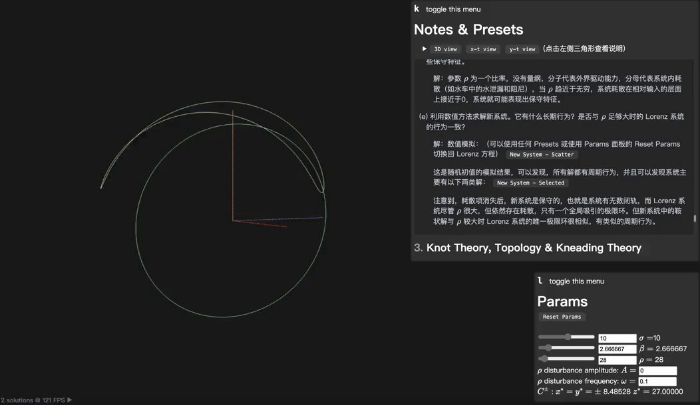
        

        

        注意到，耗散项消失后，新系统是保守的，也就是系统有无数闭轨，而 Lorenz 系统尽管 $\rho$ 很大，但依然存在耗散，只有一个全局吸引的极限环。但新系统中的鞍状解与 $\rho$ 较大时 Lorenz 系统的唯一极限环很相似，有类似的周期行为。
        

    

## 3. Knot Theory, Topology & Kneading Theory

对于其他的参数空间，情况都是非常复杂的，这里由于时间与数学能力的限制，不再展开讨论。但是，我们可以通过一些简单的例子来感受一下这些复杂的情况。

在讨论 $\sigma = 10, \beta=\frac{8}{3}$ 的同宿分岔的时候我们给出过一张图片：

  

在那之后我们讨论了 Hopf 分岔，即上图图(c)中的两个不稳定极限环与稳定不动点的合并过程。那我们有没有想过，在 Hopf 分岔后，图中红色和橙色的轨线（原点的不稳定流形）变成了什么？实际上他们成为了两个不稳定不动点的稳定流形。
  

  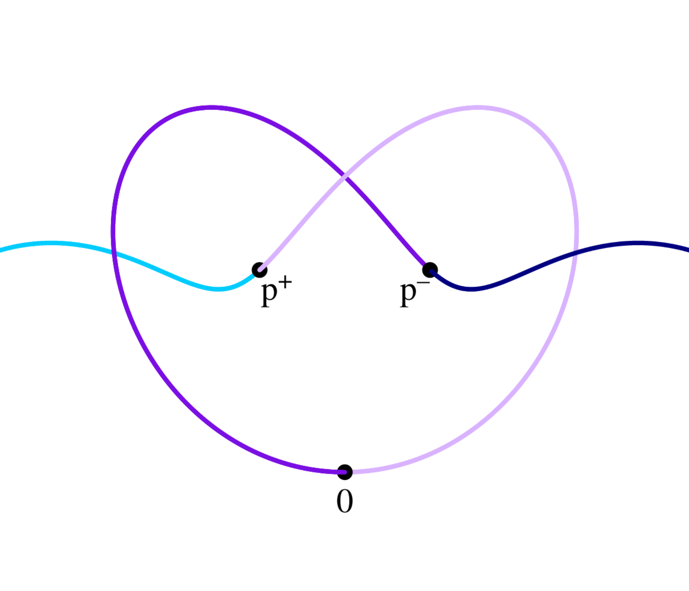

那么这里又出现了一个问题，在参数变化时，这两个流形的形状，或者说“拓扑结构”是一致的么？答案是否定的。随着参数变化，这两个流形的结构会发生根本的变化。

例如分别在
$$
\begin{aligned}
\sigma &= 10.1673, \beta=\frac{8}{3}, \rho=30.8680 \\
\sigma &= 11.8279, \beta=\frac{8}{3}, \rho=85.0292 \\
\sigma &= 12.9661, \beta=\frac{8}{3}, \rho=164.1376
\end{aligned}
$$
时，这两个流形的拓扑结构就完全不同。

当参数为后两组时，它们如下图所示：

  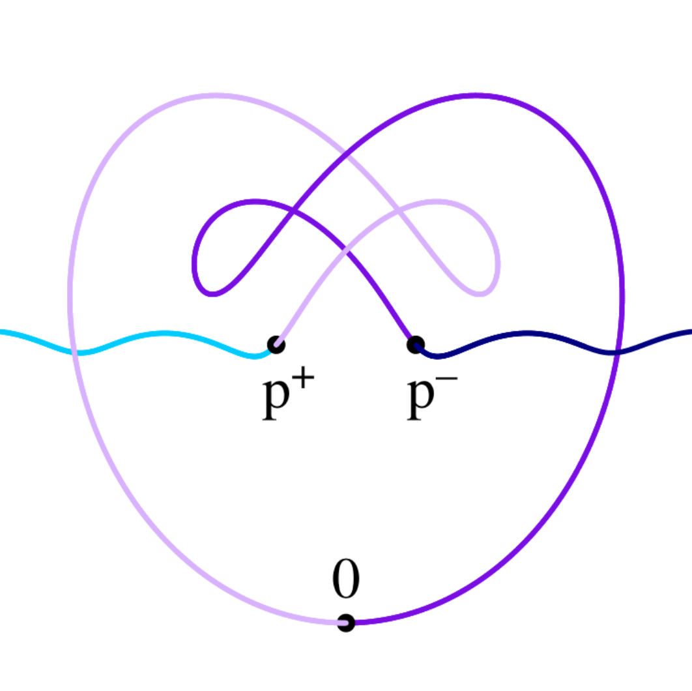
  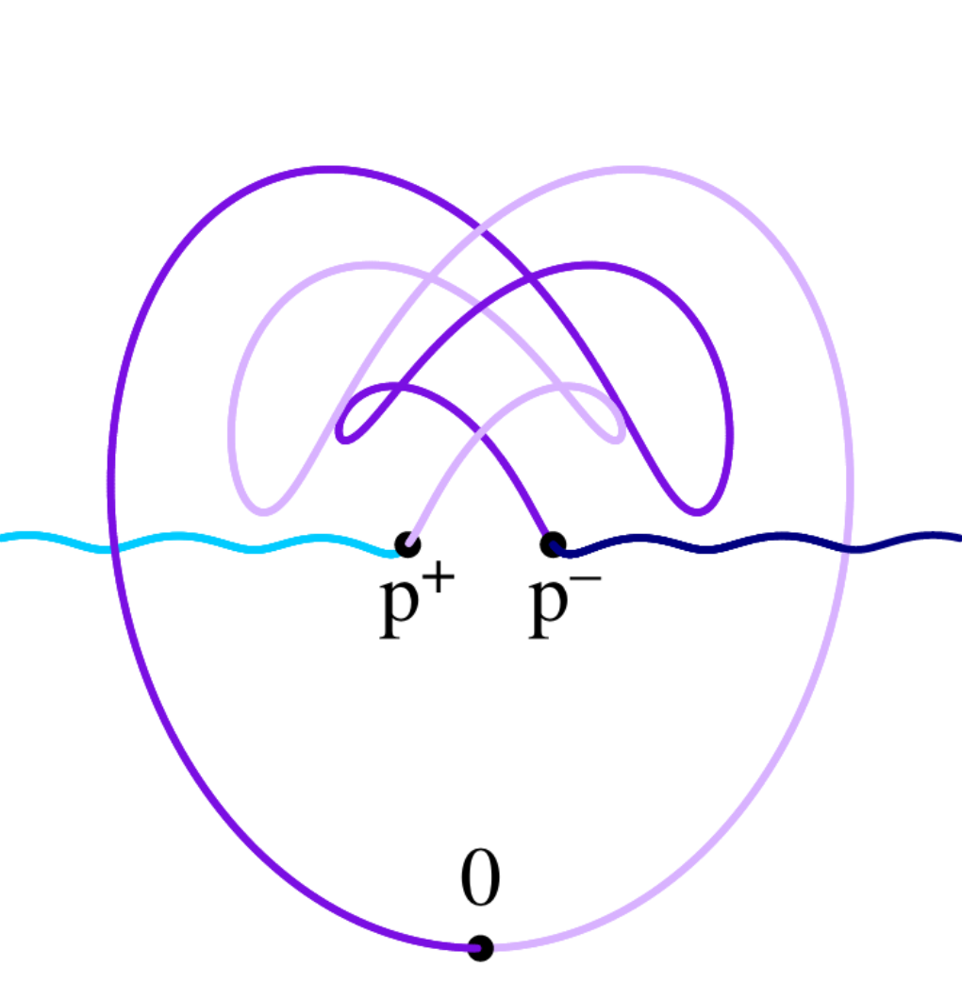

这些结有自己的名称：$S^3 \text{(Trefoil Knot)}$、 $\text{Figure Eight Knot}$、 $5_2 \text{ Knot}$

这里涉及到对参数空间的 T-Point 的分析、结理论（Knot Theory）以及许多拓扑学的知识，这里不再展开讨论。许多研究表明，T-Point 是动力系统的核心之一，且当参数经过 T-Point 时，系统的拓扑结构会随着发生根本的变化，详见 <a href="#refs">[3]</a>（以上图片也来源于此）。

    

        以下是对这些结的模拟：（注意因为数值模拟精度以及初值选取的原因，这些解最后并不会停留在不稳定不动点，但依然可以观察一开始一段时间的轨迹来观察这些结，可以使用暂停来方便地长时间观察）
    

    

        

            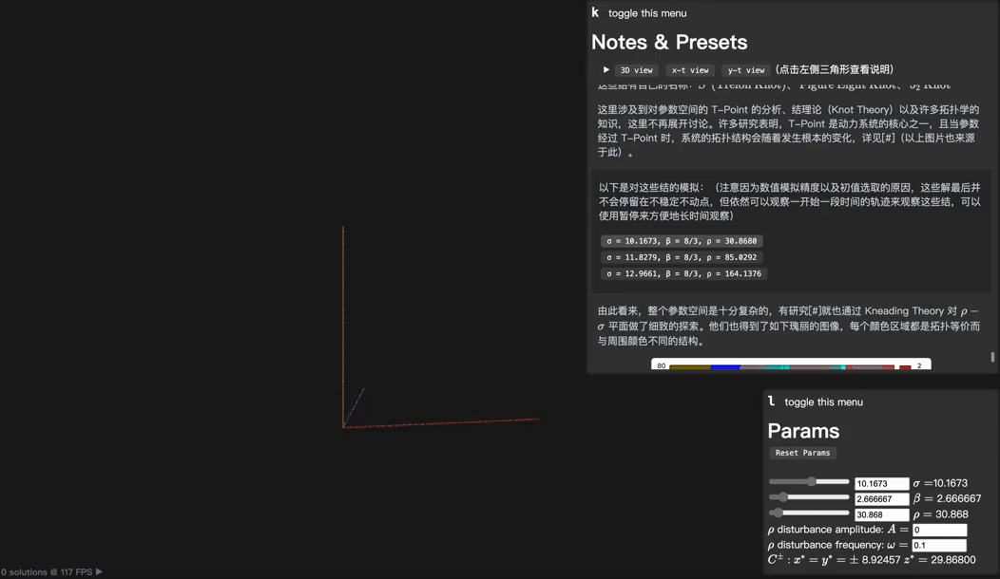
        

        

            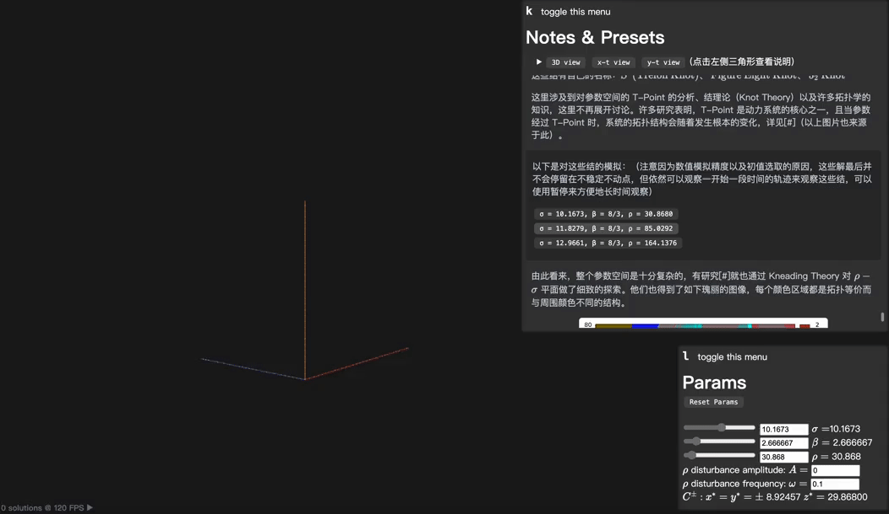
        

        

            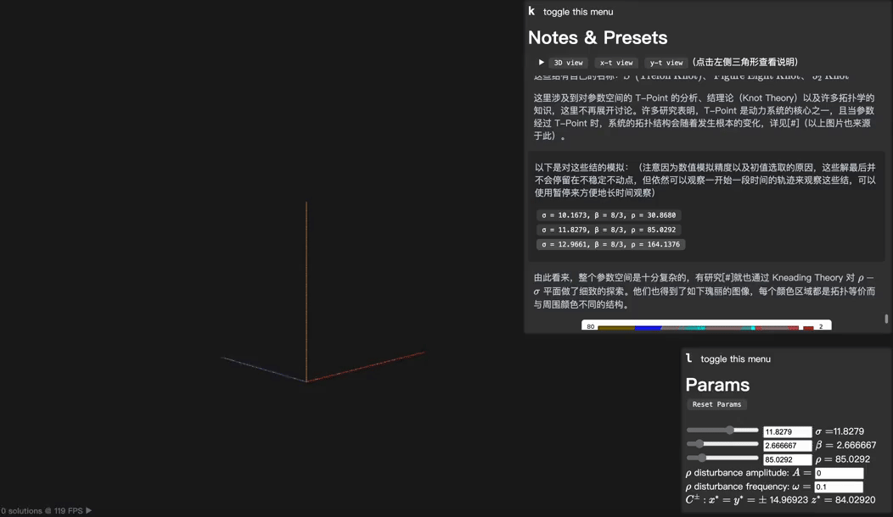
        

    

由此看来，整个参数空间是十分复杂的，有研究 <a href="#refs">[7]</a> 就也通过 Kneading Theory 对 $\rho - \sigma$ 平面做了细致的探索。他们也得到了如下瑰丽的图像，每个颜色区域都是拓扑等价而与周围颜色不同的结构，这里不再进行展开。

  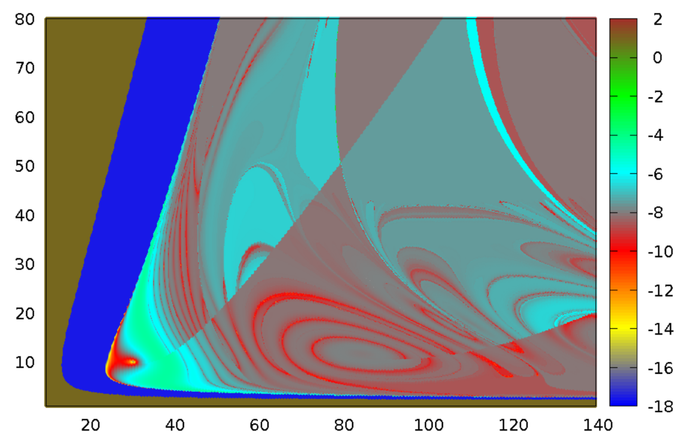

## 4. Summary

总的来说，通过本次作业，我通过数值模拟与少许解析的方式，结合大量资料，对 Lorenz 系统不同参数下的动力学行为以及拓扑结构有了更直观的认识与更深入的了解，也对混沌现象有了更深刻的认识。

## 5. Reference

[1] Lorenz System Bifurcation Diagram- Exploring Parameter Space, (Apr. 17, 2021). Accessed: Dec. 08, 2023. [Online Video]. Available: https://www.youtube.com/watch?v=-wjsjGQuFjY

[2] N. V. Kuznetsov, T. N. Mokaev, O. A. Kuznetsova, and E. V. Kudryashova, “The Lorenz system: hidden boundary of practical stability and the Lyapunov dimension,” Nonlinear Dyn, vol. 102, no. 2, pp. 713–732, Oct. 2020, doi: 10.1007/s11071-020-05856-4.

[3] T. Pinsky, “On the topology of the Lorenz system,” Proceedings of the Royal Society A: Mathematical, Physical and Engineering Sciences, vol. 473, no. 2205, p. 20170374, Sep. 2017, doi: 10.1098/rspa.2017.0374.

[4] S. Galatolo and M. Pacifico, “Lorenz-like flows: Exponential decay of correlations for the Poincaré map, logarithm law, quantitative recurrence,” Ergodic Theory and Dynamical Systems, vol. 30, Jan. 2009, doi: 10.1017/S0143385709000856.

[5] “如何通俗地解释混沌理论（chaos）和分岔理论（bifurcation）？ - 知乎.” Accessed: Dec. 08, 2023. [Online]. Available: https://www.zhihu.com/question/68229746

[6] Richard Bertram, “Chaos,” [Online]. Available: https://www.math.fsu.edu/~bertram/lectures/Chaos.pdf

[7] A. M. López, “Different dynamical aspects of Lorenz system.” [Online]. Available: https://diposit.ub.edu/dspace/bitstream/2445/127423/2/memoria.pdf

[8] James Hateley, “The Lorenz system.” [Online]. Available: https://web.math.ucsb.edu/~jhateley/paper/lorenz.pdf

